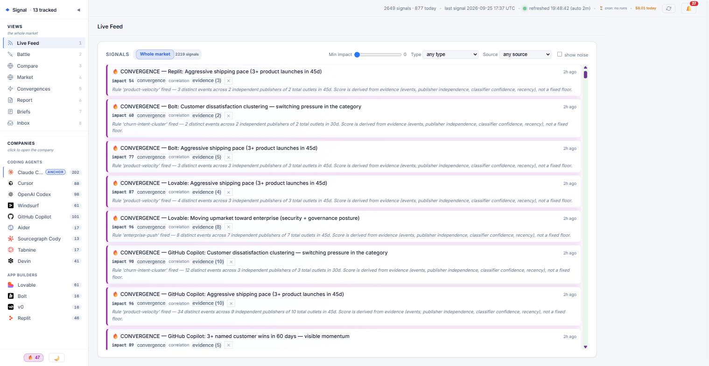
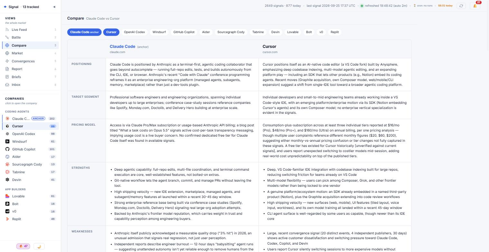
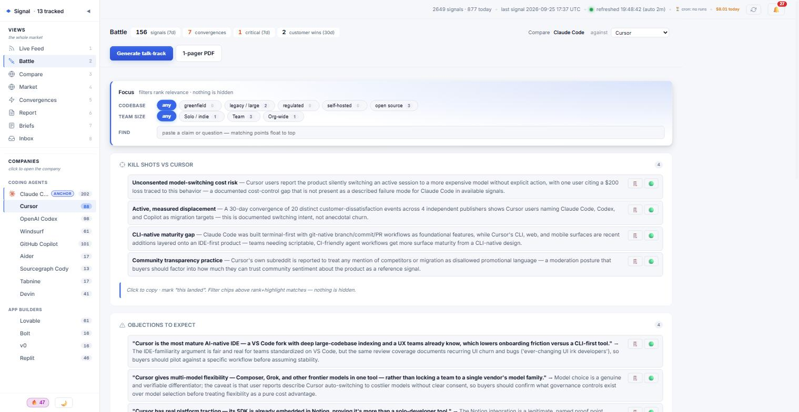

# Signal — Competitive Intelligence For Agents

**Competitive intelligence your agents can query.** Signal watches a market, turns public
noise into scored and attributed signals, and exposes them as structured data an AI agent
can actually consume — not a dashboard a human has to read.

**→ See it: [signal-v1.gledach.de](https://signal-v1.gledach.de)** — a real snapshot of a
running deployment. Every view, real data, nothing to install. It is a static export
(`npm run demo:html`), so it is read-only and dated rather than live.



*Live Feed. A **convergence** is the unit that matters: a pattern several independent
publishers corroborate, scored from its own evidence rather than a fixed floor, with the
rule that fired it stated inline.*

<details>
<summary><b>More views</b> — Compare and Battle</summary>



*Compare. The anchor company against up to three rivals, section by section. Claims carry
`[unverified]` when the signal set does not support them — the tool is built to say so.*



*Battle. Call prep for one competitor: kill shots and the objections you should expect back,
ranked against deal context (codebase size, team size) rather than dumped as a list.*

</details>

It ships tracking thirteen AI coding agents and prompt-to-app builders across two segments:
`claudecode`, `cursor`, `codex`, `windsurf` (pro-dev) and `lovable`, `bolt`, `v0`,
`replit` (vibe-coding). Point it at your own market by editing one gitignored file.

```bash
git clone https://github.com/gledach/signals.git && cd signals
npm install
npm run db:migrate     # local database + demo data. No account. No API key.
npm run doctor         # confirm it worked, and see what each missing key unlocks
npm run view           # a populated dashboard at 127.0.0.1:5180
```

That works offline on a fresh clone. There is no build step, no framework, and five
runtime dependencies — two more are optional and lazy-loaded (plus Playwright, dev-only, for screenshots).

## Who consumes it

| Consumer | Surface |
|---|---|
| **Agents** | An MCP server (`npm run mcp`) — tools, `signal://` resources and a `coverage` block on every result; skills under `.claude/skills/`; the dashboard's JSON endpoints; `npm run companies -- --json` |
| **Humans** | A localhost dashboard, markdown battlecards, analyst briefs |
| **Cron** | `npm run start` (`ops/cron-entry.mjs`) — one scheduled pass over every watcher |

The dashboard is one client, not the product. See
[docs/plans/14-agent-native-refactor.md](./docs/plans/14-agent-native-refactor.md) for
where that is going.

## Make it yours

```bash
cp config/companies.default.mjs config/companies.local.mjs   # the roster — the only file most deployments edit
npm run companies                                            # confirm what is live
npm test                                                     # gate: smoke + fixture suites (incl. email), all offline
```

`companies.local.mjs` is gitignored and overrides the shipped roster, so you can pull
upstream forever without a merge conflict in the one file you customised. Feeds, GitHub
repo mappings, HN queries and classifier collision-warnings all derive from it
automatically — **no brand name or market vocabulary is hardcoded anywhere outside
`config/`** — `npm test` fails if a brand leaks into a watcher, prompt or classifier, or
if the dashboard's category labels and deal-context axes drift from the roster.

Five more layers follow the same `.local.mjs` overrides `.default.mjs` pattern when you
need them: `deal-context` (Battle's filter axes), `subdomain-signals` (cert/sitemap
scoring), `agent-policy` (what an MCP agent may do), `aeo-prompts`, and `feeds`.

## Docs

**Index:** [docs/README.md](./docs/README.md)

| | |
|---|---|
| [docs/start.md](./docs/start.md) | Install guide assuming no prior git/Node knowledge |
| [docs/howto.md](./docs/howto.md) | Task-oriented "how do I…" |
| [docs/why.md](./docs/why.md) | Why this architecture — zero build step, 3 runtime deps (+2 optional) |
| [docs/cost.md](./docs/cost.md) | LLM spend, model ladder, budget guardrails |
| [docs/mcp.md](./docs/mcp.md) | The MCP server — tools, resources, agent policy |
| [docs/gmail.md](./docs/gmail.md) | Google Alerts via Gmail (Path A′ zones) — setup, env, hard rules |
| [docs/blindspots.md](./docs/blindspots.md) | What Signal cannot see. Honest audit |
| [docs/decisions/](./docs/decisions/) | Accepted one-way doors (incl. Gmail vs IMAP) |
| [docs/plans/](./docs/plans/) | Build plans by tier |

### Folder READMEs (code map)

| Directory | README |
|---|---|
| [`ingest/`](./ingest/README.md) | Zone 1 collectors (Gmail) — not ordinary watchers |
| [`ingest/gmail/`](./ingest/gmail/README.md) | Gmail token process modules |
| [`ingest/gmail/parsers/`](./ingest/gmail/parsers/README.md) | Alert parsers + how to add one |
| [`pipeline/`](./pipeline/README.md) | Classify / promote / notify |
| [`watchers/`](./watchers/README.md) | Public-source collectors + cron note |
| [`ops/`](./ops/README.md) | Cron, migrate, `gmail:oauth` |
| [`core/`](./core/README.md) | Store chokepoint + scoring |
| [`config/`](./config/README.md) | Roster / policy resolution |
| [`test/`](./test/README.md) | Offline gates (`npm test`) |
| [`test/fixtures/email/`](./test/fixtures/email/README.md) | Gmail parser fixtures |

### Optional: Google Alerts (local Gmail)

Phase 1 code is in-tree. **Does not** run on Railway cron by default.  
Full guide: **[docs/gmail.md](./docs/gmail.md)** — setup, env, hard rules,
[automation](./docs/gmail.md#automation-windows-task-scheduler) and
[troubleshooting](./docs/gmail.md#troubleshooting).

```bash
# Offline proof
npm run watch:gmail:dry -- --fixture=test/fixtures/email/google-alert-sample.html
# After GCP Desktop OAuth client in .env:
# npm run gmail:oauth && npm run watch:gmail && npm run email:promote:nollm
npm run doctor    # reports Gmail modules, token age, hit statuses, MCP/cron invariants
```

**Two zones, and the second one is easy to forget.** `watch:gmail` only fills the local
`data/email/inbox.db`; nothing appears in the dashboard until `email:promote` runs.
If Live Feed shows no `email-google-alert` signals, check `npm run email:requeue:dry`
for a large `pending` count — that is the usual cause, not a parser fault.

## Disclaimer

Signals are gathered from public sources. **Generated analysis — battlecards, briefs,
convergences — is model output, not verified fact**, and must be reviewed by a human
before being used externally or shown to a customer. The shipped demo dataset is a dated
snapshot of public headlines, not live data.

---

## Going further than the local default

The quick start above needs no accounts. These unlock the rest:

```bash
npm run help                                # full cheat-sheet, grouped by job
npm run fetch                               # collect fresh signals (needs no key; --no-llm for keyword-only)
# Optional local Gmail alerts (never put the refresh token on Railway in v1):
# npm run gmail:oauth && npm run watch:gmail && npm run email:promote:nollm
# → docs/gmail.md
npm run correlate                            # build convergences from what you have
npm run bootstrap -- --company=<id>          # generate a battlecard   (needs OPENROUTER_API_KEY)
npm run analyst -- --mode=brief              # analyst brief           (needs OPENROUTER_API_KEY)
npm run mcp                                  # expose it to an agent over MCP
```

| You want | You need |
|---|---|
| Collect and browse signals | nothing — local file database |
| LLM classification, battlecards, briefs | `OPENROUTER_API_KEY` |
| Broader discovery search | `TAVILY_API_KEY` |
| Multi-machine or scheduled cron | a hosted libSQL URL + token in `TURSO_DATABASE_URL` |

Everything optional degrades rather than failing: with no LLM key the keyword classifier
runs instead, and with no hosted database the local file is used.

---

## What it does

1. **Ingests** ~60 RSS feeds (Google News, Reddit, vendor blogs, GitHub releases) across the tracked roster + category-wide feeds, plus HN via Algolia, Tavily search, GitHub releases/issues, YouTube transcripts, cert-transparency, sitemap/robots diffs, Google Trends, and answer-engine visibility checks.
2. **Classifies** each signal via Claude Haiku 4.5 (over OpenRouter): `product_launch`, `pricing_change`, `funding`, `customer_win`, `review_complaint`, etc.
3. **Scores** business impact on a 0–100 scale (re-weighted for CI — product launches > generic press).
4. **Stores** in libSQL — a local file by default, a hosted Turso database when `TURSO_DATABASE_URL` points at one — keyed by content hash (`hashId PRIMARY KEY`) for idempotent dedup.
5. **Correlates** signals into convergences — cross-axis patterns (e.g. a product launch + a hiring push + a cert change all pointing at healthcare) with a structured `evidence` citation graph.
6. **Generates battlecards** — Claude Sonnet 5 synthesizes a v0 battlecard per competitor, grounded against the anchor company's card (`MAIN_COMPANY_ID`), with a human-editable section that survives refreshes. Voice comes from `core/home-brand.mjs`: partisan only when a company is marked `isUs`, third-person otherwise. Claude Opus 5 via `npm run research` for the deepest, fact-checked populations.
7. **Analyst CLI** — `npm run analyst -- --mode=<scan|deep|gap|outside|brief>` produces Obsidian-ready markdown briefs from the persona in `analyst/persona.md`.
8. **Serves a viewer** at `http://localhost:5180` — the sidebar has two labelled axes: **VIEWS** across Feed / Battle / Compare / Market / Intel / Report / Briefs / Inbox, and **COMPANIES**, where a click opens that company's page (Overview · Signals · Infrastructure · Battlecard) from anywhere. Linear-style dense UI, number keys `1`-`8` plus a `g` leader for mode switching. Compare is N-way: an anchor plus up to three rivals, shareable as `#vs=a,b,c`.
9. **Chrome extension** — side-panel UI for browsing signals, Intel Check (compare any webpage against your intel using on-device Gemini Nano), clip signals to Turso, and desktop notifications. See [`chrome-extension/README.md`](./chrome-extension/README.md).

---

## Agent surface (MCP)

`npm run mcp` starts `mcp-server.mjs` over stdio. It is the surface this repo is built
for; the dashboard is a second client. Full detail in [docs/mcp.md](./docs/mcp.md).

**Tools:** `list_companies`, `search_signals`, `get_convergences`, `get_battlecard`,
`list_briefs`, `get_brief`, `run_analyst`, `market_summary`.

**Resources:** `signal://battlecard/{companyId}` and `signal://brief/{briefId}`.

**Every signal-reporting tool returns a `coverage` block** — a collection-recency status
(`fresh` / `slowing` / `stale` / `never`), a `trustEmptyResult` flag and any warnings —
so an agent can tell "nothing happened" from "we stopped looking". Without it, a watcher
that quietly stopped running reads to an agent as a calm market.

**Read-only by default, not read-only.** `run_analyst` spends money, so it ships disabled:
`config/agent-policy.default.mjs` has an empty `allowActions`. Opt in per deployment by
creating `config/agent-policy.local.mjs` (gitignored, or point `SIGNALS_AGENT_POLICY` at
your own module) with `allowActions: ['run_analyst']`. Spend is bounded by a rolling 24h
USD ceiling read from the shared `llm_cost` table, so cron, the CLI and any agent draw
down the same ledger.

---

## Daily workflow

See `npm run help` for the full cheat-sheet. Most common:

```bash
npm run fetch                 # every 30 min via Task Scheduler, or manually
npm run correlate             # build convergences
npm run refresh               # daily on cron — refreshes all battlecards
npm run view                  # keep this tab pinned
npm run brief                 # 200-word morning brief (Opus analyst persona)
```

---

## Command reference

Every script the repo ships with, grouped by the job you're trying to do.
Rule of thumb: anything under `npm run <x>` here is safe to run as-is.

### Setup (one-time)

| Command | What it does |
|---|---|
| `npm install` | Install Node deps into `node_modules/` (~72 MB) |
| `npm run db:migrate` | Apply every file in `sql/*.sql` in lexical order — to the local file by default, to Turso when `TURSO_DATABASE_URL` is hosted. Idempotent, and seeds the demo set on a first run |
| `npm run doctor` | Reports rather than repairs: roster + anchor mode, hosted-vs-local database, collection freshness, which keys are set and what each missing one blocks, and the agent policy (plus remaining budget once a paid action is enabled). Also launches the MCP server from an unrelated directory to confirm it resolves the same store — the failure where an agent reads an empty database while the CLI sees a full one |
| `npm test` | The gate: 15 smoke sections + 5 fixture suites. Fully offline |
| `npm run smoke` | The 15 smoke sections alone, without the fixture suites |
| `npm run db:test` | Round-trip smoke test — append / alreadySeen / load / update / delete |
| `npm run check:models` | Sanity-check OpenRouter — lists default classifier / synthesis / deep models and probes one request each |
| `npm run companies` | Print the live roster and which config file it came from. `-- --json` for the machine-readable form |
| `npm run demo:seed` | Load `demo/seed-signals.jsonl` into whatever database is configured. Refuses when a local roster is active unless you pass `--force` — demo rows carry the demo roster's company ids. `db:migrate` already does this on a first run; set `SIGNALS_NO_DEMO_SEED` to suppress it |
| `npm run demo:export` | Snapshot the current database back into `demo/seed-signals.jsonl` |
| `npm run demo:clear` | Delete exactly the hashIds in the seed file. Nothing you collected yourself |
| `npm run demo:html` | Build a single self-contained HTML snapshot of the dashboard into `demo/signal-demo.html` — this is what [signal-v1.gledach.de](https://signal-v1.gledach.de) serves. It starts the real viewer, asks it the same questions the browser asks, and inlines the answers behind a `fetch` shim, so the snapshot cannot drift from the live dashboard. Degraded rows are excluded unless you pass `--include-degraded`. Override the published URL with `SIGNAL_DEMO_URL` |

### Daily pipeline — ingest

| Command | What it does | Typical cadence |
|---|---|---|
| `npm run fetch` | Walk ~60 RSS feeds (Google News, Reddit, vendor blogs, GitHub releases) across the tracked roster, classify with Haiku, write signals to the store | every 30 min – 2 h |
| `npm run fetch:nollm` | Same, keyword-only classifier. Free, lower precision | — |
| `npm run fetch -- --company=lovable` | Only one competitor this run | — |
| `npm run watch:sites` | Fetch sitemap.xml + robots.txt per domain, diff against last snapshot under `data/snapshots/`, emit signals for new / removed paths and rule changes | every 6 h |
| `npm run watch:sites:dry` | Preview diffs, write nothing | — |
| `npm run watch:certs` | Pull cert-transparency (crt.sh) entries per competitor domain, emit signals for new subdomains (leading indicator for vertical launches) | every 6 h |
| `npm run watch:certs:dry` | Preview, write nothing | — |
| `npm run watch:youtube` | Fetch each tracked channel's `/videos` page, get captions via `youtube-transcript`, classify transcripts, write signals + archive transcript excerpts to the store (mirrored at `data/transcripts/`) | daily |
| `npm run watch:youtube -- --company=claudecode` | One competitor only | — |
| `npm run watch:youtube -- --limit=3` | Only 3 most-recent per channel (cheap test) | — |
| `npm run watch:youtube -- --force-reclassify` | Re-classify videos even if hashId already seen | — |
| `npm run watch:hn` | Query Algolia HN Search API per competitor + category, filter by points/recency, classify + store signals. Replaces the hnrss.org RSS feeds that previously sat in the feed list | daily |
| `npm run watch:hn:dry` | Preview hits, classify, write nothing | — |
| `npm run watch:hn -- --company=replit` | One competitor only | — |
| `npm run watch:hn -- --no-llm` | Skip LLM classifier, use keyword only (free) | — |
| `npm run watch:github` | Walk a hardcoded `companyId → owner/repo` map for releases, breaking-change tags and issue complaints. 60 req/hr unauthenticated, 5,000/hr with `GITHUB_TOKEN` | daily |
| `npm run watch:github:dry` | Preview, write nothing | — |
| `npm run watch:aeo` | Answer-engine visibility — ask the prompts in `config/aeo-prompts.*.mjs` and record which brands each engine names when a buyer forms a shortlist. Detection is a deterministic word-boundary match, not a model judging model output. One LLM call per prompt per engine, which is why `ops/cron-entry.mjs` only runs it on the weekly pass | weekly |
| `npm run watch:aeo:dry` | Preview, write nothing | — |
| `npm run watch:tavily` | Tavily Search API queries for each competitor — mention discovery beyond RSS. Budget-guarded (~72% of free 1000/mo tier at the tracked roster daily, 2 queries each) | daily |
| `npm run watch:tavily:dry` | Preview, no API spend, no DB writes | — |
| `npm run watch:trends` | Google Trends spike detection — brand + "<competitor> alternative" queries. **Batched**: hits only the 8 stalest queries per run (rotates through all ~32 over 4 runs). Google's unofficial API rate-limits hard at 32-queries-in-a-row | weekly, scheduled 4× |
| `npm run watch:trends:dry` | Preview spikes, write nothing | — |
| `npm run watch:trends:full` | Override the batch — hit all ~32 queries in one run. Only when you know Google's rate-limiter is calm | manual |
| `npm run watch:trends -- --geo=GB` | Regional scoping (default US) | — |
| `npm run watch:trends -- --batch-size=16` | Override batch size (default 8) | — |
| `npm run all` | Convenience wrapper: fetch + hn/sites/certs/youtube/tavily/trends + correlate + refresh, in sequence. Use for end-of-day catch-up runs. Note it does NOT run `watch:github` or `watch:aeo` — `ops/cron-entry.mjs` covers both, this wrapper does not | manual |

### Convergence / pattern detection

| Command | What it does |
|---|---|
| `npm run correlate` | Load recent signals from Turso, apply THEME + COUNT rules from `correlation-rules.mjs`, emit `convergence` signals when patterns fire. Dedup by iso-week |
| `npm run correlate:dry` | Print what *would* fire, write nothing |
| `npm run clean:convergences` | Delete every `signalType='convergence'` row in Turso. Use before a `correlate` re-run if you've tuned the rules |

### Battlecard generation

| Command | What it does |
|---|---|
| `npm run self-bootstrap` | Generate / refresh `battlecards/<your-id>.md` — the home vendor's own positioning, features matrix, USPs. Only meaningful when a company is marked `isUs`; in market-watch mode there is no self-card |
| `npm run bootstrap -- --company=<id>` | Generate one competitor battlecard from the signal set, grounded against the anchor's card (`MAIN_COMPANY_ID`). Sonnet 5, ~8-12k tokens, ~$0.09 |
| `npm run refresh` | Re-generate the AUTO section of all 13 battlecards in sequence (plus the self-card, if a company is marked `isUs`). Runs on the cron's **daily** tier; weekly is the cheaper choice if the cards rarely move. Operator-written HUMAN text is never overwritten — an all-placeholder scaffold is rewritten to match the anchor mode, and `npm run research` appends its own block inside HUMAN |
| `npm run research -- --company=<id>` | **Deep research via Opus 5** — populates the HUMAN section with fact-checked overview, verified facts, objections to expect, deep weaknesses, recent moves, rumor watch, operator todos. 180-day signal window. ~$0.50 per run |
| `npm run research:dry -- --company=<id>` | Preview Opus input without calling the model. `--company=` is required — without it the script exits 2 with a usage error |

### Analyst persona (briefs)

Persona lives in `analyst/persona.md`. Five modes from it, each produces
Obsidian-ready markdown in `briefs/YYYY-MM-DD-<mode>.md` (gitignored).

| Command | What it does |
|---|---|
| `npm run report:weekly` | **Weekly Report snapshot** — deterministic compute (no LLM), captures convergences + top-10 signals + per-competitor synopsis for the ISO week. Persists to Turso + `briefs/weekly-<week>.md`. Idempotent per week. Schedule Mondays 07:00 |
| `npm run report:weekly -- --week=2026-W15` | Regenerate a specific week (useful for backfill) | — |
| `npm run report:weekly:dry` | Compute the snapshot and print a preview of it, write nothing |
| `npm run brief` | `/brief` mode — 5-minute morning brief. Max 200 words. Last 24h critical signals. ~$0.03 |
| `npm run scan` | `/scan` mode — routine sweep over last 14d high-impact + convergences, capped at 80 signals. Top 5 ranked. ~$0.08 |
| `npm run analyst -- --mode=deep --company=lovable` | `/deep` — 90-day deep dive on one competitor. Cites convergences by hashId via the structured `evidence` graph |
| `npm run deep:all` | `/deep` across every tracked competitor in one pass. ~$0.20 and ~30s each, so cost scales with the roster — `ops/cron-entry.mjs` only fires it on the Monday pass, and the MCP surface never exposes it |
| `npm run deep:all:dry` | Same sweep, prints the assembled input, sends nothing |
| `npm run analyst -- --mode=outside --topic=<string>` | `/outside` — analogies from adjacent markets, second-order effects, one defended contrarian take |
| `npm run analyst -- --mode=gap` | `/gap` — red-teams Signal *itself*: feeds list, correlation rules, feature registry, tracked-company bias. Different target from the other modes. Monthly cadence |
| `npm run analyst -- --mode=scan --dry-run` | Print digest + persona size without calling the model. Confirms the Turso query + digest assembly path works |

### Transcripts

| Command | What it does |
|---|---|
| `npm run transcripts` | List all archived transcripts (store rows merged with the `data/transcripts/` mirror) |
| `npm run transcripts -- --stats` | Word counts per competitor |
| `npm run transcripts -- "pricing"` | Case-insensitive substring search, highlighted, with ≤3 snippets per hit |
| `npm run transcripts -- "SOC 2" --company=claudecode` | Scope search to one competitor |
| `npm run transcripts -- --id=<videoId>` | Print one full transcript |
| `npm run transcripts -- "enterprise" --context=100` | Wider snippet window |
| `npm run backfill:transcripts` | Walk every `sourceKind='youtube'` signal in Turso; fetch + save any missing transcripts. Safe to re-run. This is where local Whisper runs (if `CI_WHISPER_ENABLED=true`). Whisper additionally requires `yt-dlp` and `ffmpeg` on PATH (`pipx install yt-dlp`) — audio is downloaded with yt-dlp, not an npm package |
| `npm run backfill:transcripts -- --dry-run` | Preview what would be fetched |
| `npm run transcripts:sync` | Promote any disk-only transcript into the store. One-off, for an archive collected before the store was canonical |
| `npm run transcripts:sync:dry` | Preview what would be promoted |

**YouTube pipeline in one breath:** `watch:youtube` fetches captions via HTTP (no audio download, no transcription — free for ~80% of videos), archives a bounded excerpt to the `artifacts` table (mirrored at `data/transcripts/<co>/<id>.json`), classifies the first 6000 chars via Haiku, writes one signal row to Turso. Whisper is opt-in, only fires for caption-less videos when you explicitly enable it — otherwise the video still gets a `noise` signal noting that captions weren't available.

### Re-classification

| Command | What it does |
|---|---|
| `npm run reclassify` | Re-run the classifier against signals already in Turso. Updates signalType + impactScore in-place when the new call differs. Defaults to LLM-classified / keyword / keyword-fallback signals only, excludes heuristic + convergence |
| `npm run reclassify:dry` | Preview which signals would change, no writes |
| `npm run reclassify -- --company=<id>` | Scope to one competitor |
| `npm run reclassify -- --limit=50` | Cap the batch |
| `npm run reclassify -- --all` | Include all classifyMethods + signalTypes (use with care) |

### Viewer (dashboard)

| Command | What it does |
|---|---|
| `npm run view` | Start `dashboard/serve.mjs` on `http://localhost:5180`. Linear-style sidebar nav across Feed / Battle / Compare / Market / Intel / Report / Briefs / Inbox. Keyboard: `1`-`8` or `g` + `f`/`b`/`c`/`m`/`i`/`r`/`s`/`x` for mode, `j`/`k` for list nav, `Cmd+K` for the command palette |
| `Ctrl+C` | Stop the viewer |

### LLM cost tracking

Every OpenRouter call appends one JSONL row to `data/llm-cost.jsonl` with
timestamp, script, model, tokens, USD cost (passthrough + upstream),
duration, and caller-supplied tags (company, mode). A per-process footer
prints after any run that crosses $0.001 of spend.

Every call also mirrors into the Turso `llm_cost` table (fire-and-forget) so history
survives a redeploy — the JSONL is wiped on every Railway deploy — and so the MCP agent
budget in `core/agent-budget.mjs` can draw down the same ledger as cron and the CLI.
`npm run cost` reports from the local JSONL, so the two can diverge.

| Command | What it does |
|---|---|
| `npm run cost` | Last 30 days, grouped by day + script + model |
| `npm run cost:today` | Just today |
| `npm run cost:7d` | Last 7 days |
| `npm run cost -- --by=script` | Group by script name |
| `npm run cost -- --by=model` | Group by model slug |
| `npm run cost -- --by=company` | Group by `meta.company` tag (only rows with one) |
| `npm run cost -- --raw` | Dump every line as JSON for piping into jq / spreadsheet |
| `npm run cost -- --all` | All time, no window |

### Visual tooling (Playwright via system Edge)

Screenshots for design review + regression spotting. Browser used is the
system-installed Microsoft Edge (`channel: 'msedge'`) — we skip Playwright's
Chromium download to avoid corporate-proxy TLS issues.

| Command | What it does |
|---|---|
| `npm run shot` | Screenshot each mode `tools/shot.mjs` knows about, in the dark theme — `--mode=all` is the default. Output lands in `screenshots/` (gitignored) |
| `npm run shot -- --mode=battle --competitor=lovable` | Battle mode for one competitor |
| `npm run shot -- --mode=intel` | Intel mode (convergence list) |
| `npm run shot -- --mode=market` | Market mode |
| `npm run shot:all` | The same sweep, stated explicitly — one file per mode, in the dark theme. Add `-- --theme=light` for the light set |

### Notifications

| Command | What it does |
|---|---|
| `npm run notify:test` | Fire a test Windows toast to confirm `node-notifier` + Focus Assist are playing nicely. Rate-limited to 5/run by default |

### Chrome extension

| Command | What it does |
|---|---|
| `npm run chrome-data` | Generate `chrome-extension/data/companies.json` — pre-baked signal digest (last 7 days) for instant Intel Check |
| `npm run chrome-data -- --days=14` (or `npm run chrome-data:14d`) | Same, but last 14 days |

The extension itself loads as an unpacked Chrome extension — see [`chrome-extension/README.md`](./chrome-extension/README.md) for install instructions.

### Docs / first-time users

| Doc | When to read |
|---|---|
| [docs/start.md](./docs/start.md) | First-time setup — zero prior knowledge of git / Node / terminals. ~15 min |
| [docs/cost.md](./docs/cost.md) | Per-command cost ranges, model tiering (cheap → premium), BYOK, budget guardrails |
| [docs/howto.md](./docs/howto.md) | Task-oriented ("how do I…"). The manual |
| [docs/mcp.md](./docs/mcp.md) | The MCP server — tools, `signal://` resources, coverage block, agent policy |
| [docs/nextsteps.md](./docs/nextsteps.md) | Where Signal is heading architecturally — the knowledge-graph direction |
| [docs/blindspots.md](./docs/blindspots.md) | What Signal can't see. Honest audit + quarterly review checklist |
| [docs/roadmap.md](./docs/roadmap.md) | Master roadmap; index of tiered plans |
| [docs/plans/](./docs/plans/) | Individual plan files (quick wins → crazy ideas, plus approved 08 knowledge graph and 09 document ingest) |
| [analyst/persona.md](./analyst/persona.md) | The senior CI analyst prompt that drives `npm run analyst` — five modes, output contract, hard rules, banned words |
| [chrome-extension/README.md](./chrome-extension/README.md) | Chrome side-panel extension — install, features, architecture, data flow |

### Environment variables (summary)

Model and notification defaults live in [.env.example](./.env.example); the config-layer
overrides are listed here. Nothing in this table is needed for the quickstart:

| Var | Required | Purpose |
|---|---|---|
| `OPENROUTER_API_KEY` | for LLM features | Classification, battlecards, briefs. Without it the keyword classifier runs instead |
| `TURSO_DATABASE_URL` | hosted only | `libsql://…` URL for a hosted DB. Defaults to the local file `data/signals.db` |
| `TURSO_AUTH_TOKEN` | hosted only | Long-lived JWT for a hosted DB |
| `TAVILY_API_KEY` | optional | Enables `watch:tavily` (free tier: 1000 cr/mo) |
| `GITHUB_TOKEN` | optional | Raises the GitHub API limit for `watch:github` from 60/hr to 5,000/hr. `GH_TOKEN` is accepted too |
| `CI_CLASSIFIER_MODEL` | optional | Per-signal triage (high volume). Default `anthropic/claude-haiku-4.5`. Qwen / Kimi alternatives in `.env.example`. **Never Opus — a single fetch is 200+ calls.** |
| `CI_SYNTHESIS_MODEL` | optional | Battlecard synthesis (medium volume). Default `anthropic/claude-sonnet-5` |
| `CI_DEEP_MODEL` | optional | Analyst `/deep`, `/gap`, `/outside`, `research` (low volume, max reasoning). Default `anthropic/claude-opus-5` |
| `CI_WHISPER_ENABLED` | optional | Set `true` to enable local Whisper fallback for caption-less YouTube videos. Disabled by default. Also requires `yt-dlp` and `ffmpeg` on PATH (`pipx install yt-dlp`) — audio is downloaded with yt-dlp, not an npm package |
| `CI_WHISPER_MODEL` | optional | Whisper model name, default `base.en` |
| `CI_TOAST_THRESHOLD` | optional | Min impact score for Windows toasts (0-100, 101 disables). Default 80 |
| `CI_TOAST_MAX_PER_RUN` | optional | Hard cap on toasts per process run. Default 5 |
| `CI_VIEWER_URL` | optional | Dashboard URL clicked toasts open. Default `http://localhost:5180` |
| `CI_TAVILY_MONTHLY_BUDGET` | optional | Tavily credit cap. Default 800 |
| `CI_TAVILY_MIN_HOURS_BETWEEN_RUNS` | optional | Tavily cooldown. Default 12 |
| `SIGNALS_COMPANIES` | optional | Path to a roster module, overriding `config/companies.local.mjs` / `.default.mjs` |
| `SIGNALS_FEEDS` | optional | Path to a feeds module. Feeds derive from the roster, so most deployments never set this |
| `SIGNALS_DEAL_CONTEXT` | optional | Path to a deal-context module — the Battle filter axes. See `config/deal-context.default.mjs` |
| `SIGNALS_SUBDOMAIN_SIGNALS` | optional | Path to a subdomain/sitemap scoring module. See `config/subdomain-signals.default.mjs` |
| `SIGNALS_AGENT_POLICY` | optional | Path to an agent-policy module — what an MCP agent may trigger and its spend ceiling. Ships read-only |
| `SIGNALS_AEO_PROMPTS` | optional | Path to an answer-engine prompt module. See `config/aeo-prompts.default.mjs` |
| `NODE_TLS_REJECT_UNAUTHORIZED` | ⚠ | Set to `0` ONLY for corporate-proxy unblock; prefer `NODE_EXTRA_CA_CERTS` |
| `NODE_EXTRA_CA_CERTS` | optional | Path to corporate root CA PEM — proper TLS fix |

---

### Model selection

Three independently-tunable knobs, each matched to a workload. All override
via env vars; full alternatives live commented in [.env.example](./.env.example).

| Knob | Workload | Volume | Default | Why this default |
|---|---|---|---|---|
| `CI_CLASSIFIER_MODEL` | Per-signal triage (fetch / watch:hn / watch:tavily / reclassify) | **Thousands of calls per run** | `anthropic/claude-haiku-4.5` | Reliable JSON output via OpenRouter `response_format`; fast; cheap enough that a 500-signal fetch is under $0.10 |
| `CI_SYNTHESIS_MODEL` | Battlecards + self-card synthesis | Dozens per week | `anthropic/claude-sonnet-5` | Best balance of structured-output instruction-following + cost. ~$0.08–0.12 per battlecard |
| `CI_DEEP_MODEL` | Analyst modes + `npm run research` | 1-10 per day | `anthropic/claude-opus-5` | Max reasoning depth; Opus handles the "red-team my CI pipeline" (/gap) and "predict roadmap" kind of thinking that cheaper models get shallow on. ~$0.50 per research run, ~$0.08 per /scan |

**Cheap swap for the classifier:** `qwen/qwen3-coder` or `qwen/qwen3.6-plus-04-02` or `moonshotai/kimi-k2.5-0127` — all strong JSON output at a fraction of Haiku's price. Verify with `npm run cost -- --by=model` after a week.

**Never set the classifier to Opus.** A single `npm run fetch` can fire 200+ classifier calls; at Opus rates that's ~$3 per fetch, burns the OpenRouter monthly key budget in days. The short-circuit added in `classify.mjs` will fall back to keyword if you hit a 403, but Opus-as-classifier is fundamentally the wrong trade.

**BYOK (bring-your-own-key):** at <https://openrouter.ai/settings/integrations> you can link your Anthropic / OpenAI / xAI / DeepSeek API keys directly, so OpenRouter routes requests through your own keys and you pay those providers' direct rates (cheaper than OpenRouter's margin on top). The local cost logger tracks `upstreamCost` separately from `passthroughCost` so reporting works either way.

---

### Disaster recovery

This applies to a hosted deployment. The default is a local libSQL file, which has no
outage to survive — but once `TURSO_DATABASE_URL` points at Turso, a Turso outage means
you can't read or write signals. The system is designed around "retry when it's back,"
but here's the fallback ladder if you ever hit sustained downtime:

1. **Transient outage (<1 hour)** — Do nothing. `INSERT OR IGNORE` on every
   watcher makes re-runs idempotent; the next scheduled cron catches up.
2. **Sustained outage (hours)** — Swap `TURSO_DATABASE_URL` in `.env` to a
   local libSQL file temporarily: `file:./data/signals-local.db`. The
   `@libsql/client` library supports both seamlessly. Run `npm run db:migrate`
   against the local DB once, then carry on with fetch/watch/correlate. When
   Turso is back, export your local DB and merge:
   ```bash
   sqlite3 data/signals-local.db ".dump signals" > local-signals.sql
   turso db shell signals < local-signals.sql
   ```
3. **Account loss / credential leak** — Provision a fresh database, point
   `TURSO_DATABASE_URL` / `TURSO_AUTH_TOKEN` at it and run `npm run db:migrate`.
   There is no JSONL archive to restore from: signals regenerate by re-running
   the watchers, and battlecards / briefs / talk-tracks re-hydrate from their
   on-disk mirrors (`core/artifacts.mjs` reads database-first, disk-fallback).

**What's NEVER lost:**

- Battlecards (`battlecards/*.md`) — in git
- Analyst persona (`analyst/persona.md`) — in git
- Schema (`sql/*.sql`) — in git
- Cost log (`data/llm-cost.jsonl`) — local disk, gitignored but survives turso outages
- YouTube transcripts (`data/transcripts/`) — disk mirror of the `artifacts` rows
- Saved talk-tracks (`data/talk-tracks/`) — disk mirror of the `artifacts` rows

Only things in Turso can be lost in a Turso-account incident: signals + watcher baselines. Both are regenerable (signals by re-running fetch, baselines by letting the first post-restore run capture a new baseline).

---

### Running with a collaborator

Two operators sharing the same Turso DB is supported — nothing corrupts
if you both run commands simultaneously. Every write is either
`INSERT OR IGNORE` (signals dedup on `hashId`) or `UPSERT` (state rows
last-write-wins). But concurrent runs have different cost profiles:

| Command | Concurrent behavior |
|---|---|
| `view`, `cost`, `transcripts` | ✅ Fully safe. Read-only or local-file-only |
| `analyst`, `brief`, `scan` | ⚠ Safe — each writes a brief row to Turso keyed per mode+date, plus `llm_cost` rows. Two concurrent runs of the same mode last-write-wins on the brief; you pay 2× LLM cost |
| `bootstrap`, `research`, `refresh` | ✅ Safe — each writes its own local `battlecards/*.md` file. If both commit, normal git merge conflict |
| `fetch`, `watch:hn`, `watch:youtube` | ⚠ Safe but **wasteful** — both run the full external-API sweep + LLM classifier. You pay 2× API cost, dedup catches the duplicates on write |
| `correlate` | ⚠ Safe — convergence dedup by hashId; wall time is the only cost |
| `watch:sites`, `watch:certs`, `watch:trends` | ⚠ Last-write-wins on baselines. Small data loss if one run's diff gets overwritten by the other's concurrent write. Next run re-baselines correctly |
| `watch:tavily` | 🚨 **Budget race.** The singleton credit counter can under-count: both read `credits=20`, both spend 5, both write `25` — but the second write wins so you've spent 30 credits and only recorded 25. 12h internal cooldown prevents single-operator double-spend but not two operators |

**Practical rule:**

- **Scheduled crons** (Task Scheduler / Coolify / GitHub Actions): don't coordinate. Accept a small amount of waste.
- **Manual ad-hoc runs**: a quick "running fetch now" in chat saves API dollars.
- **The only thing worth actively coordinating**: `watch:tavily` — don't both fire it within the same hour. Tavily credits are real money on paid tiers.

---

## Architecture

Grouped by role, not by feature — `config/` holds what a deployment retargets, `core/`
the domain logic, and the entry points a human or a cron actually invokes live in `cli/`,
`watchers/` and `ops/`.

```
Signal/
├── .env                  OpenRouter + Turso credentials + Tavily
├── package.json          Deps: @libsql/client, google-trends-api, node-notifier,
│                         nodejs-whisper, youtube-transcript (+ playwright, dev)
├── mcp-server.mjs        The agent surface — tools, signal:// resources, coverage
│
├── config/               Everything a deployment retargets. Each layer resolves
│                         $SIGNALS_* → *.local.mjs → *.default.mjs:
│                         companies, feeds, deal-context, subdomain-signals,
│                         agent-policy, aeo-prompts. Plus correlation-rules.mjs
│
├── core/                 Domain logic, no I/O entry points:
│                         store (libSQL client), artifacts (the one safe way to
│                         read/write a generated document), features, scoring,
│                         signal-taxonomy, home-brand (anchor mode + voice),
│                         coverage, agent-budget, registry, events, robots, feed-urls
│
├── runtime/              env.mjs (.env loader) + paths.mjs (the one path resolver)
│
├── pipeline/             classify, openrouter, correlate, transcript, notify
│
├── watchers/             fetch-signals, hn, sites, certs, youtube, github, tavily,
│   └── adapters/         trends, aeo — and the rss / reddit / tavily / youtube-channel
│                         source adapters they share
│
├── cli/                  Every `npm run` entry a human types: analyst, help, doctor,
│                         bootstrap-*, refresh-battlecards, cost-report, reclassify,
│                         weekly-report, transcripts, chrome-data, demo, list-companies
│
├── ops/                  cron-entry.mjs, db-migrate.mjs, notify-test.mjs
│
├── dashboard/
│   ├── serve.mjs         Zero-dep localhost server + JSON endpoints
│   └── viewer/           index.html + viewer.js + viewer.css (static, no build)
│
├── sql/                  001-init … 009-artifacts — nine migrations, applied in order
├── test/                 smoke.mjs (the gate) + store-roundtrip + fixtures/
├── tools/                shot.mjs + inspect.mjs — Playwright visual tooling
│
├── analyst/persona.md    Senior CI analyst persona (loaded at runtime)
├── battlecards/          MD files (HUMAN + AUTO sections)
├── briefs/               Analyst CLI output (gitignored)
├── demo/                 seed-signals.jsonl — the shipped demo dataset
├── chrome-extension/     Side-panel extension (unpacked)
├── docs/                 start / howto / why / cost / mcp / blindspots / roadmap / plans
├── data/                 gitignored runtime cache
└── reference/            Pointer to the originating news-into-intelligence repo
```

---

## Key decisions

- **Standalone repo** — originally lived inside `news-into-intelligence/competitive/`; extracted when it proved 100% self-contained.
- **libSQL** — plain SQL over HTTP, no schema-deploy step, and no reactive runtime this workload has any use for. Works behind a corporate proxy, and runs identically as a local file or a hosted database, which is what lets a fresh clone work with no account.
- **Schema source of truth** — `sql/*.sql` migration files. Applied via `npm run db:migrate`. Never talk to the DB directly from caller code — use `core/store.mjs`.
- **JSONL → Turso** — original signals were flat files; now stored in Turso with indexes for fast queries.
- **Zero-dep philosophy** — only libSQL + a couple of adjacent tools added; everything else uses Node built-ins.
- **Battlecards as Markdown in git** — versioning for free; HUMAN section never overwritten by LLM refreshes.

---

## Cost (at current volume)

| Service | Monthly |
|---|---|
| OpenRouter (Haiku + Sonnet + occasional Opus) | ~$15–25 |
| Turso free tier (9 GB storage, 1B reads, 25M writes) | $0 |
| Tavily free tier (1000 credits) | $0 |
| **Total** | **~$20/mo** |

---

## How this repo is worked on

Signal needs none of the following — it is a plain Node project and `npm test` is the whole
gate. But the two tools below shaped how it was built, and they are the reason a lot of the
comments in here explain *why* rather than *what*:

- **[apsolut-seshat](https://github.com/apsolut/apsolut-seshat)** — a notes vault that sits
  beside a repo rather than inside it: inbox → ideas → plan → decisions → knowledge. What
  keeps working notes, half-formed ideas and operational detail **out** of the codebase, so
  what remains in `docs/` is documentation rather than someone's scratchpad.
- **[apsolut-agents](https://github.com/apsolut/apsolut-agents)** — a shared workspace for
  several AI agents on one repo: an append-only log, task cards, human-gated one-way doors,
  and one agent able to dispatch another and stay accountable for the result. Several
  decisions here came out of adversarial review between models — see
  [docs/decisions/](./docs/decisions/), which records the rejected option as well as the
  accepted one.

Neither is a dependency and neither ships in this repo. If you work with AI agents on a
codebase you own, both are worth a look.

## See also

- [docs/roadmap.md](./docs/roadmap.md) — master roadmap
- [docs/plans/](./docs/plans/) — plans, and [00-backlog](./docs/plans/00-backlog.md) for unbuilt ideas
